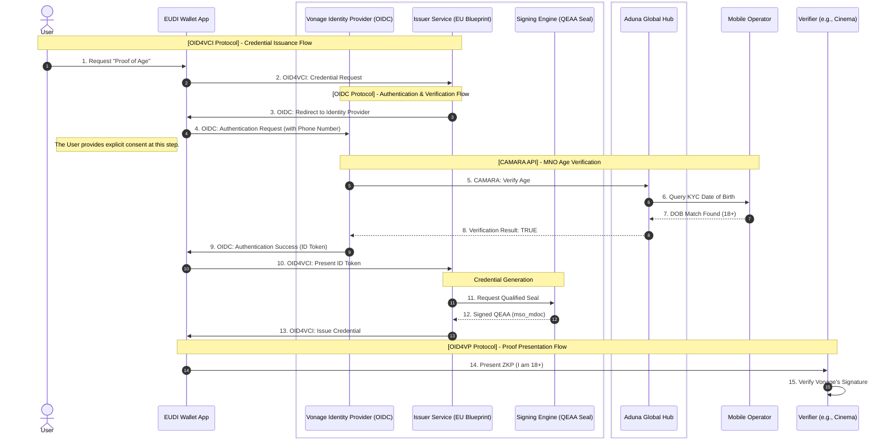

# Architecture

This document outlines a compliant architecture for an age verification system where Vonage acts as the issuer, leveraging the EU's reference software and MNO data for verification.

The key design principle is the **separation of concerns**:
1.  **Identity & Age Verification:** A new OIDC-compliant service is created to verify the user's age via their Mobile Network Operator (MNO).
2.  **Credential Issuance:** The standard EU Age Verification Issuer software is used, configured to trust our new OIDC service.

## Components

*   **User:** The individual attempting to prove their age.
*   **EUDI Wallet App:** A mobile application on the user's device that manages identity credentials.
*   **Vonage Services:**
    *   **Vonage Identity Provider (OIDC):** A new service that acts as an OpenID Connect provider. Its purpose is to authenticate a user by verifying their age via the Aduna Hub and MNO, then issuing a standard OIDC `ID Token`.
    *   **Issuer Service (EU Blueprint):** The standard Age Verification Issuer software. It is configured to trust the `Vonage Identity Provider`. It receives the `ID Token` as proof of authentication and then proceeds to issue the age attestation.
    *   **Signing Engine (QEAA Seal):** A Qualified Trust Service Provider that signs the age attestation (`mso_mdoc`) with a Qualified Electronic Attestation of Attributes (QEAA) seal.
*   **Verification Hub (Aduna):** An intermediary service that connects to various Mobile Network Operators (MNOs) via the CAMARA API standard.
*   **Mobile Operator (MNO):** The user's mobile carrier, which holds Know Your Customer (KYC) data, including the user's date of birth.
*   **Verifier:** An entity that needs to verify the user's age (e.g., a cinema).

## Flow Description

1.  **Request Credential:** The user initiates a request for a "Proof of Age" credential in their EUDI Wallet.
2.  **Credential Request (OID4VCI):** The Wallet sends a request to the Vonage Issuer Service using the OID4VCI protocol.
3.  **Redirect for Authentication (OIDC):** The Issuer Service, seeing the user is not authenticated, redirects the Wallet to the configured `Vonage Identity Provider` to handle authentication, as per the standard OIDC flow.
4.  **Authentication & Consent (OIDC):** The Wallet sends an authentication request to the `Vonage Identity Provider`. At this point, the Identity Provider presents a consent screen to the user. The user explicitly authorizes Vonage to perform the age check with their MNO for this specific transaction.
5.  **Verify Age (CAMARA):** Once the user grants consent, the `Vonage Identity Provider` calls the Aduna Global Hub via a CAMARA API to verify the user's age based on their phone number.
6.  **Query MNO:** Aduna routes the request to the correct MNO.
7.  **Get KYC Data:** The MNO checks its KYC records and confirms the user is over the required age threshold.
8.  **Return Verification Result:** The result is passed back to the `Vonage Identity Provider`.
9.  **Issue ID Token (OIDC):** With the age successfully verified, the `Vonage Identity Provider` issues a standard OIDC `ID Token` back to the Wallet. This token confirms that the user has been successfully authenticated.
10. **Present ID Token (OID4VCI):** The Wallet presents this `ID Token` to the Issuer Service as proof of authentication.
11. **Request Signature:** The Issuer Service now trusts that the user is authenticated. It creates the age claim (`over_18: true`) and requests the Signing Engine to sign it.
12. **Generate Signed Attestation:** The Signing Engine returns a signed `mso_mdoc` credential.
13. **Issue Credential (OID4VCI):** The Issuer Service sends the final, signed "Proof of Age" credential to the user's Wallet.
14. **Present Proof (OID4VP):** At a later time, the user can present a Zero-Knowledge Proof (ZKP) from their credential to a Verifier.
15. **Verify Signature:** The Verifier checks that the proof is valid and that the original credential was signed by Vonage.