# Support

This section is intended to assist all users on how to use the system to request a Proof of Age, aiming to demonstrate it explicitly and as straightforwardly as possible.

## 1. Authorization Code Grant: 

The authorization request is initiated during the wallet interaction.

Select the "Proof of Age" credential and the "Authorization Code Grant" option, then click "Submit" to proceed.

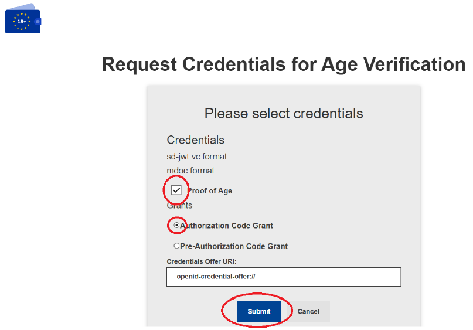

The following page displays a QR Code. If you are using a device with the wallet installed, simply click on "Use Age Verification Wallet" to be automatically redirected to the wallet. Otherwise, you will need to scan the QR Code using the device that contains the wallet. 

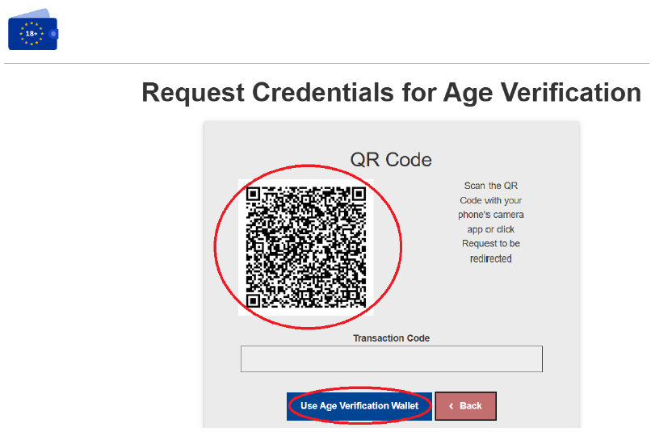

In the wallet application, an option to add the "Proof of Age" to your wallet will be displayed. Simply click on "Add" to continue.

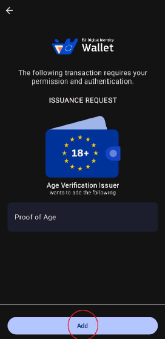

Next, the form will be presented, where the user can check the "age_over_18" field, which is the only mandatory field. Several optional elements will then be displayed, which the user can choose to select or leave unselected, but they are not required. Finally, it is necessary to click the "Submit" button at the bottom of the page to proceed.

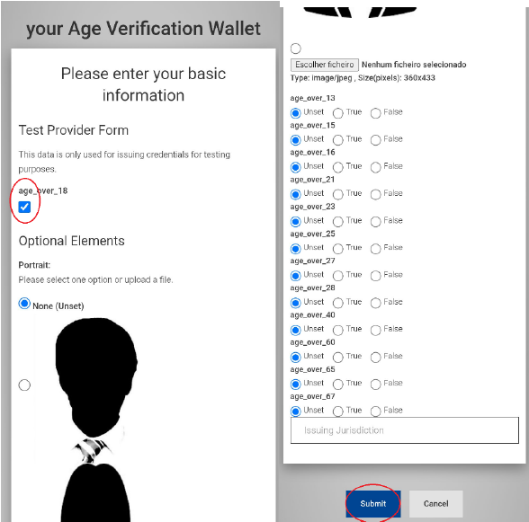

The page is now presented where the user authorizes the sharing of the data provided during the form. To proceed, simply click the "Authorize" button.

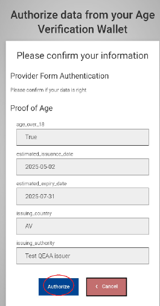

Here, we can see the final feedback indicating whether it was successfully added to the wallet or not, showing "successfully added" followed by "Proof of Age" underneath.

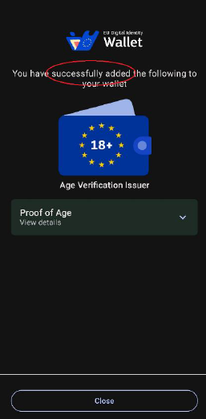

## 2. Pre-Authorization Code Grant: 

The authorization is pre-approved via a form, generating a code that can subsequently be used to proceed with the credential request.

Select "Proof of Age" and "Pre-Authorization Code Grant" and click "Submit" to proceed.

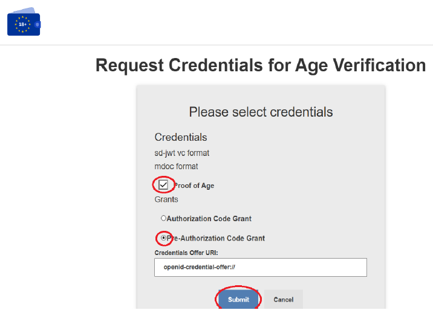

Next, the form will be presented, where the user can check the "age_over_18" field, which is the only mandatory field. Then, several optional elements will be displayed that the user may or may not select, but these are not required. Finally, it is necessary to click the "Submit" button at the bottom of the page to proceed.

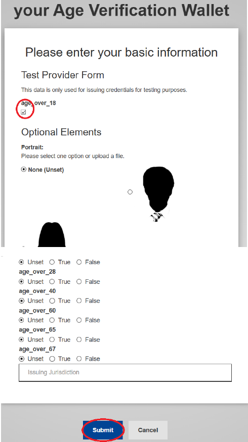

The page is now presented, where the user authorizes the sharing of the data provided in the form. To proceed, simply click the "Authorize" button.

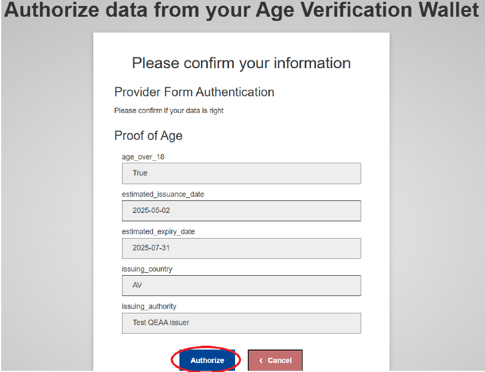

The page is now displayed with a QR Code. If you are using a device that has the wallet, simply click on "Use Age Verification Wallet", and you will be automatically redirected to the wallet. If using another device, you will need to scan the QR Code with the device that has your wallet. Below, you can see the "Transaction Code", which is generated in the form and will later be used to continue the request.

In the wallet application, the option to add the “Proof of Age” to your wallet will be displayed. Simply click on “Add” to continue.

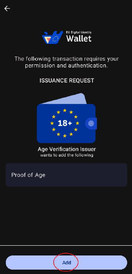

Next, a 5-digit code will be requested, which is the “Transaction Code” that was previously displayed. To continue, simply enter the code

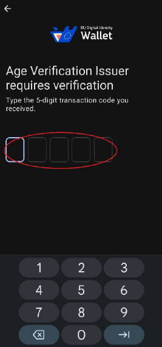

Finally, you will see the final feedback on whether it was successfully added to your wallet, where it will say "Successfully added" followed by "Proof of Age" underneath.

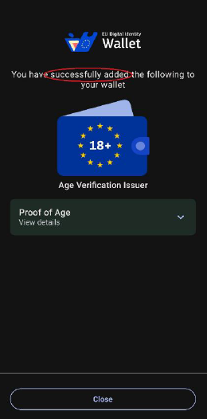
